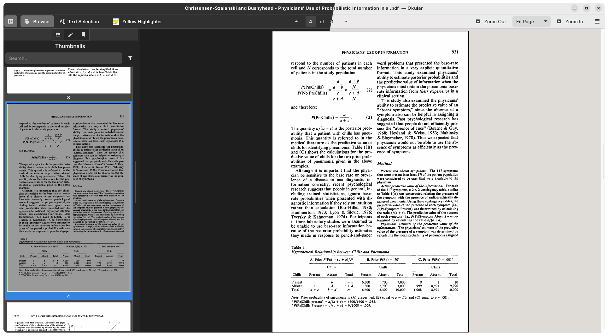
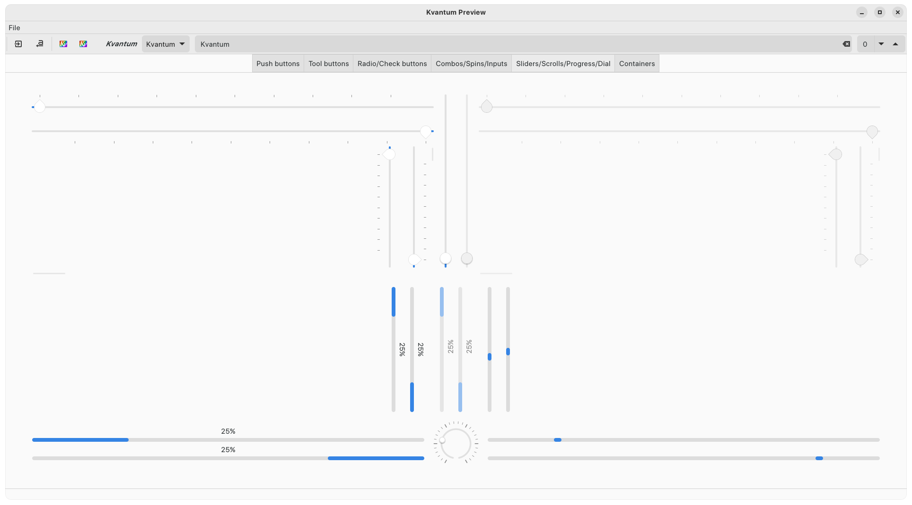
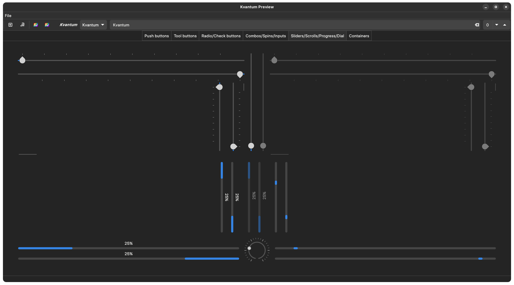

# KvLibadwaita

 Libadwaita style theme for Kvantum. Originally based on [Colloid-kde](https://github.com/vinceliuice/Colloid-kde).

## Whoops it's an info dump

This project is not *currently* being actively maintained (although I'm reluctant to formally archive it because I might pick it up again someday) on account of me not currently using it and also being in busy PhD/life mode. If anyone wants to pick up maintenance, they are welcome to.

## Installation

```
git clone https://github.com/GabePoel/KvLibadwaita.git
cd KvLibadwaita
./install.sh
```
Or just copy `src/KvLibadwaita` into `~/.config/Kvantum`.

## Preview






