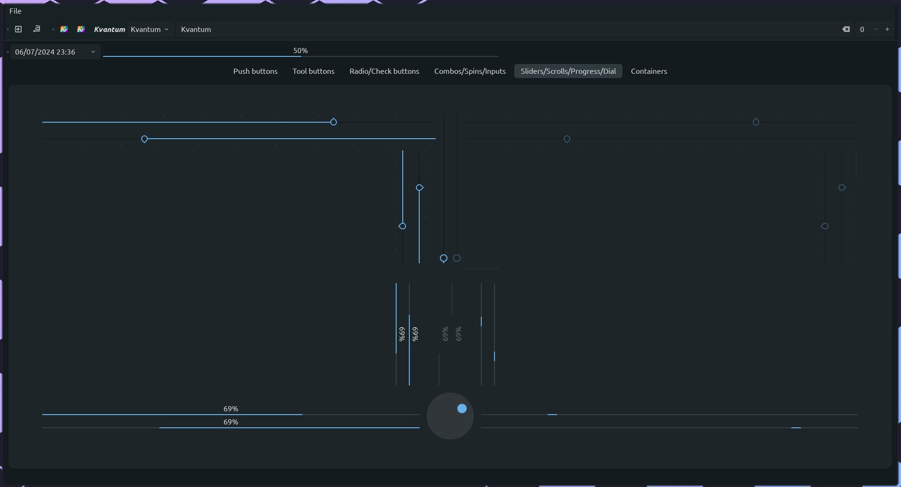

# KvLibadwaita

 Libadwaita style theme for Kvantum. Originally based on [Colloid-kde](https://github.com/vinceliuice/Colloid-kde).

## Whoops it's an info dump

This project is not *currently* being actively maintained (although I'm reluctant to formally archive it because I might pick it up again someday) on account of me not currently using it and also being in busy PhD/life mode. If anyone wants to pick up maintenance, they are welcome to.

## Installation

```
git clone https://github.com/GabePoel/KvLibadwaita.git
cd KvLibadwaita
./install.sh
```
Or just copy `src/KvLibadwaita` into `~/.config/Kvantum`.

## Preview


## Gradience

### What is it?

A feature that allows you to redefine KvLibadwaita colors.
It will help if you use a specific color scheme throughout the system.

Works similar to the utility of the same name [Gradience](https://gradienceteam.github.io/)

Under the hood, standard color schemes are used [base16](https://github.com/chriskempson/base16)
Depending on the specified theme during the building, the KvLibadwaita colors are compared and subsequently replaced.
The final version will be available in the `gradience/result` directory

Contains 35 popular theme presets

- ashes
- aquarium
- ayu_dark
- ayu_light
- bearded_arc
- blossom_light 
- catppuccin_frappe
- catppuccin_latte
- catppuccin_macchiato
- catppuccin_mocha
- decay 
- dracula
- everblush
- everforest_dark
- everforest_light
- falcon
- gruvbox_dark
- gruvbox_light
- kanagawa
- melange
- monochrome
- monokai
- mountain
- nord
- onedark
- onelight
- rosepine
- rosepine_dawn
- rosepine_moon 
- solarized
- sweetpastel
- rxyhn  
- tokyodark
- tokyonight
- yoru

If your favorite color scheme is not in the list,
you can send your theme to the builder in base16 format
The file must be in `.json` format

#### Example your-base16.json

```json
{
  "scheme": "onedark",
  "author": "https://github.com/one-dark",
  "base00": "#1e222a",
  "base01": "#353b45",
  "base02": "#3e4451",
  "base03": "#545862",
  "base04": "#565c64",
  "base05": "#abb2bf",
  "base06": "#b6bdca",
  "base07": "#c8ccd4",
  "base08": "#e06c75",
  "base09": "#d19a66",
  "base0A": "#e5c07b",
  "base0B": "#98c379",
  "base0C": "#56b6c2",
  "base0D": "#61afef",
  "base0E": "#c678dd",
  "base0F": "#be5046"
}
```

Since themes are generated automatically,
unfortunately it is impossible to fine-tune them individually.
If you want to change the accent for example you will have to try changing
the color matches manually in the `gradience/matchers` files


## Installation gradience theme (For all users)

To install, use the script `kvctl.sh` in the root of the repository

```console
Usage: ./kvctl.sh [options]                                      

Options:                                                        
  
 --no-ask    | -na  don't ask for confirmation                  
 --build     | -b   {theme_name}                                
 --install   | -i   {theme_name}                                
 --uninstall | -u   uninstall theme                             
 --version   | -v   print version                               
 --help      | -h   print this message and exit                 
 
Examples:                                                       
   
./kvctl.sh --build nord    the nord theme will be built into gradience/result       
./kvctl.sh --install       the default theme will be installed   
./kvctl.sh --install nord  the nord theme will be installed      
./kvctl.sh --install custom ~/my-base16.json                     
./kvctl.sh --uninstall     current theme will be uninstalled 
```

## Installation gradience theme (For Nix users)

To install it you **must have flake enabled** and your NixOS configuration
**must be managed with flakes.** See [Flakes](https://nixos.wiki/wiki/Flakes) for
instructions on how to install and enable them on NixOS.

If you are new to NixOS here is a useful channel [Vimjoyer](https://www.youtube.com/watch?v=rEovNpg7J0M)

You can add this flake as inputs in `flake.nix` in the repository
containing your NixOS configuration:

```nix
  inputs = {
    nixpkgs.url = "github:nixos/nixpkgs/nixos-unstable";
    home-manager = {
      url = "github:nix-community/home-manager";
      inputs.nixpkgs.follows = "nixpkgs";
    };
    # ...
    kvlibadwaita = {
    url = "github:GabePoel/KvLibadwaita";  # or replace to fork owner
    inputs.nixpkgs.follows = "nixpkgs";
    };
    # ...
  };

This flake provides an overlay for Nixpkgs, with package and a home-manager module.

They are respectively found in the flake as

- `inputs.kvlibadwaita.overlays.default`
- `inputs.kvlibadwaita.overlays.kvlibadwaita`
- `inputs.kvlibadwaita.packages.${system}.default`
- `inputs.kvlibadwaita.packages.${system}.kvlibadwaita`
- `inputs.kvlibadwaita.homeManagerModule`
  
(Where `${system}` is either `x86_64-linux` `aarch64-linux` `x86_64-darwin` `aarch64-darwin`)

Output data can be added in different ways.

Use the one you are familiar with, the main thing is 
to make `inputs` available inside the home-manager configuration 
or pass the package to the `nixpkgs` overlay

In the example below, the home manager is installed as a NixOS module

```nix
  outputs = { self, nixpkgs, home-manager, ... }@inputs:
    let
      system = "x86_64-linux";
      lib = nixpkgs.lib;
      pkgs = import nixpkgs { inherit system; config.allowUnfree = true; };
      extraSpecialArgs = { inherit system; inherit inputs; };  # <- passing inputs to the attribute set for home-manager
      specialArgs = { inherit system; inherit inputs; };       # <- passing inputs to the attribute set for NixOS (optional)
    in {
    nixosConfigurations = {
      laptop = lib.nixosSystem {  # <- your device name
        modules = [
          inherit specialArgs;           # <- this will make inputs available anywhere in the NixOS configuration
          ./hosts/laptop/configuration.nix
          {  # <- # example to add the overlay to Nixpkgs:
            nixpkgs = {
              overlays = [
                inputs.kvlibadwaita.overlays.default
              ];
            };
          }
          home-manager.nixosModules.home-manager {
            home-manager = {
              inherit extraSpecialArgs;  # <- this will make inputs available anywhere in the HM configuration
              useGlobalPkgs = true;
              useUserPackages = true;
              users.yourname = import ./homes/your@user/home.nix;
            };
          }
        ];
      };
    };
  };
```

Now you can call the package anywhere as a package from nixpkgs

- `pkgs.kvlibadwaita`

Examples:
- `users.users.<name>.packages = [ pkgs.kvlibadwaita ];` NixOS
- `home.packages = with pkgs; [ pkgs.kvlibadwaita ];`    home-manager


#### Configuration

Depending on which usage method you choose, take a look at a couple of snippets:

##### home-manager module

Somewhere in your `home.nix` or a separate module:

Default:

```nix
{ inputs, config, pkgs, ... }: {  # <- don't forget inputs
  imports = [
    inputs.kvlibadwaita.homeManagerModule  # <- bring HM-module from flake
  ];
  qt = {
    enable = true;
    platformTheme.name = "qtct";
    style.name = "kvantum";
    kvlibadwaita = {
      enable = true;
      auto = false;       # <- set true the theme will be applied automatically, if false select the theme in kvantummanager
      theme = "onedark";  # <- set your favorite
    };
  };
}
```
##### Available options:

`qt.libadwaita`:

- enable
- theme
- auto
- base16-scheme-path

If you want to add your theme declaratively:

```nix
{ inputs, config, pkgs, ... }: {  # <- don't forget inputs
  imports = [
    inputs.kvlibadwaita.homeManagerModule  # <- bring HM-module from flake
  ];
  qt = {
    enable = true;
    platformTheme.name = "qtct";
    style.name = "kvantum";
    kvlibadwaita = {
      enable = true;
      auto = false;
      theme = "custom";  # <- in this case you need to also pass the path to the base16.json file, see below
      base16-scheme-path = ./change/it/to/your/path/base16.json
    };
  };
}
```

## Gradience examples





